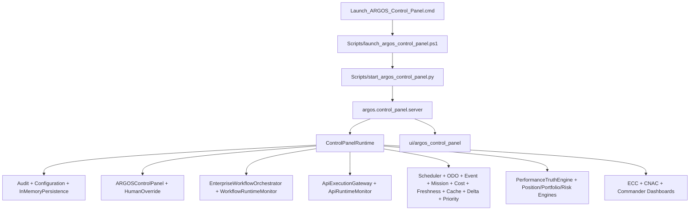

# OR-001 Dependency Graph Report

## Startup Graph

## Critical Modules

- `runtime.py`: central composition root and single largest integration point.
- `server.py`: HTTP/API boundary.
- `workflow_orchestrator.py`: LAW VII lifecycle.
- `api_execution_gateway.py`: AI/model/API boundary.
- `performance_truth_engine.py`: paper/live trading truth.
- `scheduler.py`: mission/wake authority.
- `enterprise_doctrine_policy_manager.py`: policy layer.
- `enterprise_communications_bus.py`: message transport.

## Optional / Advisory Modules

Analytics, simulation, market replay, strategy packages, explainability, benchmarking, learning, and Commander review modules are advisory unless wired into mission/workflow authorization.

## Single Points of Failure

- `ControlPanelRuntime` is a large in-process integration hub.
- In-memory audit/persistence means process loss equals operational state loss.
- The UI and server share a local monolith pattern; no external service boundary exists.

## Hidden / Soft Dependencies

- Many engines expect snapshots from other engines as dictionaries rather than typed contracts.
- Runtime state assembly is an implicit dependency graph; the repo has no machine-readable architecture manifest.
- `PROJECT_HANDOFF.md` is a better current-state source than `README.md`, creating documentation dependency ambiguity.

